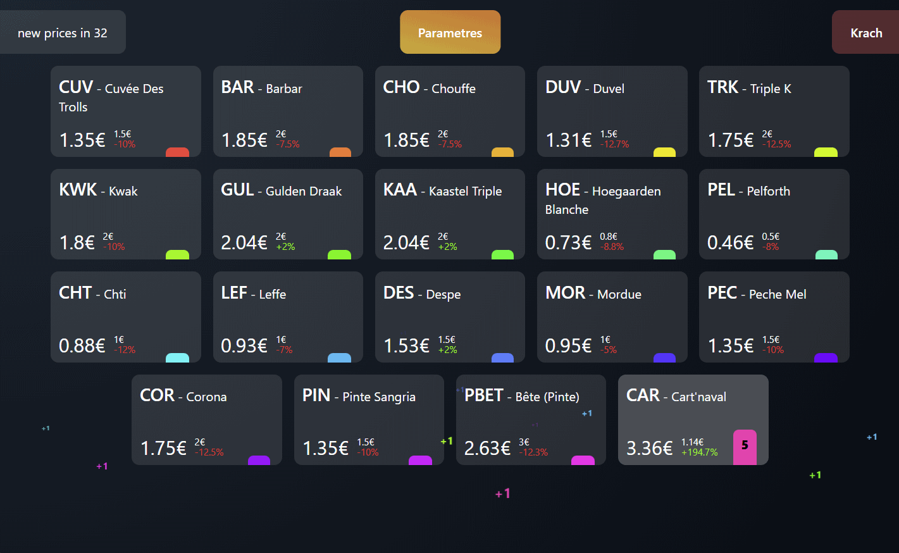
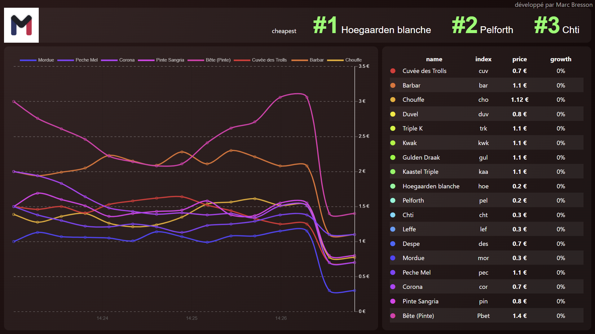

<div align="center">
    <h1>Stock Market Anywhere</h1>
    <h2>Developed by Marc Bresson</h2>
    <p align="center">
        <a href="https://linkedin.com/in/marc--bresson"></a>
    </p>
    <h3>Adaptation by Klaas Neyens</h3>
    <p align="center">
        <a href="https://www.linkedin.com/in/klaas-neyens/"></a>
    </p>
</div>

Personal project of a web app that reproduce the stock market on anything, with a price variation depending on the sale volume. This web app is entirely local, and requires no installation.

# Let the party begin !


You will need two screens for this app. One for the administration panel, where you register sales, and the other one for the public dashboard with charts and more information.

#### The administration panel:


#### The dashboard:


## Initialisation

Edit your goods and prices in ~~`parameters > default_prices.js`~~ `settings.html`. ~~You have to follow this structure :~~

[//]: # (```js)

[//]: # ({)

[//]: # (    "tgr" : { // the trigram of the good)

[//]: # (        "full_name": "Trigram", // the full name of the good)

[//]: # (        "initial_price": 1.0, // the start price)

[//]: # (        "krach_price": 0.5, // the price of the good during the krach periods)

[//]: # (        "min_price": 0.4 // OPTIONAL : the minimum price. If not specified, the good will not have any limit, and will be regulated by the market)

[//]: # (    })

[//]: # (})

[//]: # (```)

~~Open admin.html in Chrome or Edge (unfortunately, it doesn't work on Firefox, see #18), and follow the instructions. You will be prompted to either `Schedule the party`, or `Start now`.~~


#### Using `Schedule the party`


You will be asked at what time to start the party, and for a message for the countdown. Once you click on `validate`, another window will pop up with a countdown, intended for the customers. When the countdown hits 0, it will automatically switch to the dashboard.

#### Using `Start now`

This will immediately open the dashboard in another window. Place this window on your second public screen, and keep the admin panel for your team and yourself.

## During the party

### Make a sale


- Press <kbd>Left-Click</kbd> button to add a single item to the current sale.
- Hold down <kbd>Left-Click</kbd> for 0.5 seconds to add 10 units of the selected item at once.
- Press <kbd>Right-Click</kbd> to subtract one unit of the selected item.

#### Information displayed on each button:
- At the top, you have the trigram followed by the full name.
- At the bottom left in bold, you have the current price.
- In green at the bottom, you have the variation between the initial price and the current price.
- Just above the variation, you have the initial price of the item.
- In black on a colourful background, you see the number of items added to the current sale.

### Make it crash

Using the light red button in the top right corner, you can immediately start a market crash. During a crash, all prices drop down to the prices you defined in ~~`default_prices.js`~~ `settings.html`.

Prices after the crash will return to their values as before the crash.



### ~~Change interval time or price variation amplification~~

~~If you want to change the default interval time (60s) or the default price variation amplification (100, see the wiki on how are new prices calculated), you can use the parameters button at the top of the administration panel.~~

~~Here, you can change parametres, and validate them by clicking the `validate` button.~~

[//]: # (![Parametres]&#40;images/parametres.png&#41;)

## Stop the party

There is no mechanism to stop the party. You can close the admin tab, or reload it. By doing so, the public dashboard will no longer be updated.

If you choose to reload it, you will be able to download your party data in CSV format.


# License

This license lets you remix, adapt, and build upon this work non-commercially, as long as you credit me and license your new creations under the identical terms.

If you want to use it commercialy, do not hesitate to contact me (Marc Bresson), I will be glad to help.


